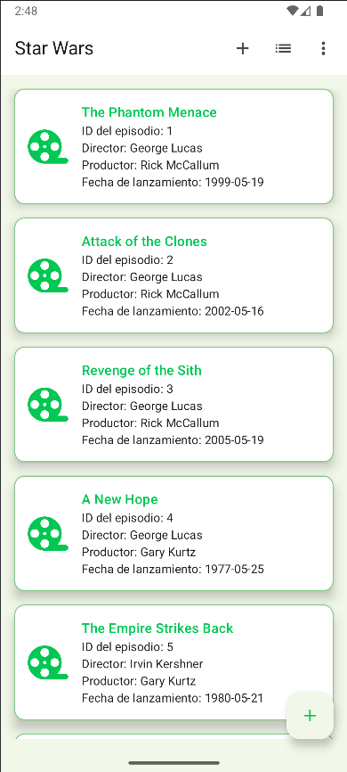
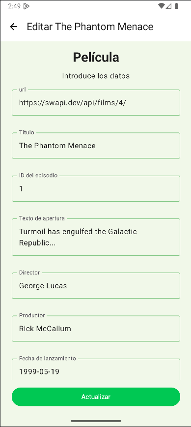
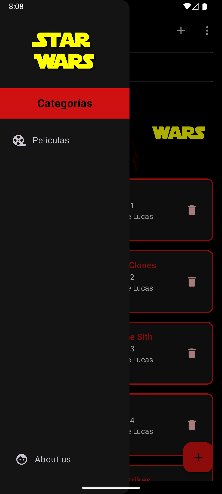
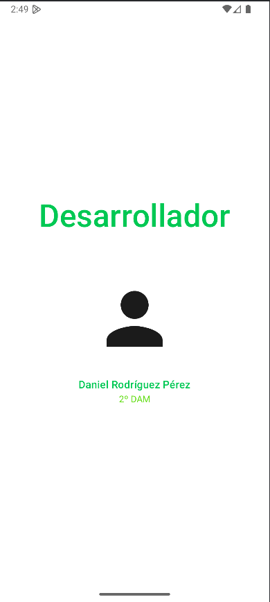
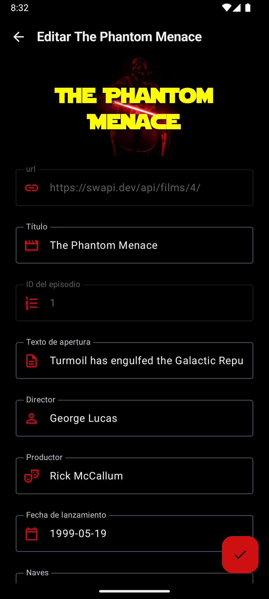
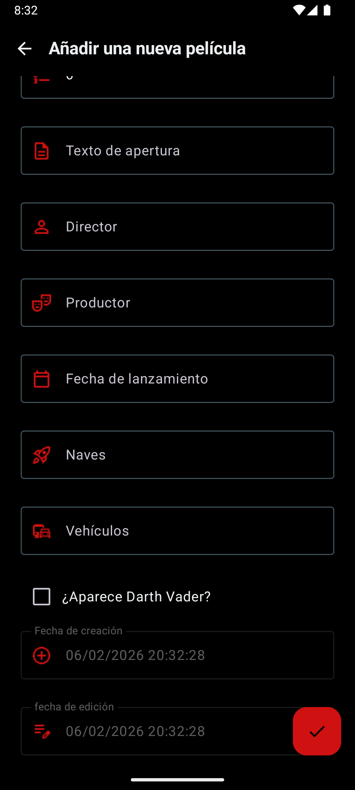

# Proyecto Android: ListStarWars

Este proyecto consiste en una aplicación Android moderna desarrollada con **Jetpack Compose** que permite gestionar un listado de películas de la saga Star Wars. La aplicación implementa un sistema **CRUD** completo (Crear, Leer, Actualizar y Borrar), siguiendo la arquitectura **MVVM** (Model-View-ViewModel).

En esta versión 3.0, la aplicación incluye persistencia de datos real con **Room**, un sistema de navegación (**Drawer**), gestión de **permisos y notificaciones**, y una interfaz de usuario mejor personalizada y dinámica al tema del sistema.

---

## Estructura del proyecto

### Capa de Datos (Room & Repository)
* **StarWarsDatabase.kt & FilmDAO.kt:** Implementación de la base de datos local usando **Room**. Define las entidades y las consultas SQL para interactuar con la base de datos SQLite.
* **FilmRepository.kt:** Intermediario que expone los datos de la base de datos al resto de la app, transformando las entidades en objetos de dominio si fuera necesario.

### Capa de UI (Pantallas y Navegación)
* **MainActivity.kt:** Punto de entrada que configura el tema, `CompositionLocal` para dimensiones y estilos, y contiene el ModalNavigationDrawer que envuelve a toda la aplicación.
* **NavHostScreen.kt:** Gestiona el grafo de navegación y transiciones entre pantallas.
* **FilmGraph.kt:** Define la extensión del grafo de navegación para el flujo de películas, centralizando rutas y configurando reactivamente la **TopBar** y el **FAB**.
* **DrawerContent.kt:** Define la estructura `DrawerItem` para representar tipadamente las opciones del menú lateral y facilitar su construcción en el `ModalDrawerSheet`.
* **FilmListScreen.kt:** Pantalla principal. Ahora incluye una **barra de búsqueda reactiva**, listas optimizadas y tarjetas (**Cards**) rediseñadas con acciones directas (editar/borrar).
* **FilmScreen.kt:** Pantallas de formulario. Gestionan la validación (fechas, duplicados), solicitan permisos de notificación y utilizan un 
* **FilmViewModel.kt & ListViewModel.kt:** Gestionan la lógica de negocio, comunicándose con el repositorio de forma asíncrona mediante **Corrutinas** y **Flow**.
**FloatingActionButton** dinámico para guardar.
* **FilmScreenContent.kt:** Formulario reutilizable. Ahora incluye **cabeceras dinámicas** que cambian según el texto introducido y validaciones en tiempo real para fechas y duplicidad de títulos.
* **LoadingScreen.kt & NoDataScreen.kt:** Pantallas de estado que gestionan la espera con animaciones personalizadas o la ausencia de registros en la base de datos.
* **AboutUsScreen.kt:** Pantalla de información rediseñada con enlaces externos.

### Capa de Utilidades (Helpers & Design)
* **NotificationHandler.kt:** Gestiona la creaciónm de canales de notificación y el envío de las mismas al usuario tras añadir con éxito.
* **PermissionHelper.kt:** Implementa el helper `rememberPermissionsLauncher` para gestionar solicitudes de permisos mediante `ActivityResultContracts`.
* **MaterialSpecifications.kt:** Generaliza el diseño (dimensiones y estilos de campos de texto) mediante `CompositionLocal` para mejor coherencia visual.

---

## Funcionamiento

La experiencia de usuario ha sido rediseñada para ser más fluida y completa. Así es como se interactúa con la versión 3.0.0:

1. **Navegación Global (Drawer):**
   Accisible mediante el icono de hamburguesa en la barra superior o deslizando desde el borde izquierdo. Desde aquí puedes navegar rápidamente entre el listado de películas y la pantalla aboutUs.

2. **Exploración y Búsqueda:**
   En la pantalla principal, aparece el listado de películas cargadas desde la base de datos.
   * **Búsqueda en tiempo real:** La barra de búsqueda superior permite filtrar películas por título mientras escribes.
   * **Gestión rápida:** Cada tarjeta de película tiene un icono de papelera para eliminarla directamente y se puede pulsar en cualquier parte de la tarjeta para editarla.

3. **Añadir una Película:**
   Al pulsar el botón flotante +, se accede al formulario de creación:
   * **Cabecera Dinámica:** Al empezar a escribir el titulo, la cabecera aparece y el texto cambia según se escribe.
   * **Validaciones Inteligentes:**
     * Al intentar usar un título que ya existe, la app avisará con un diálogo antes de guardar.
     * Las fechas se validan automáticamente para asegurar el formato correcto.
   * **Permisos y Notificaciones:** Al guardar una película con éxito, la app solicitará permiso para enviar notificaciones. Al aceptar, se recibe una notificación de confirmación.

4. **Personalización y Tema:**
   Toda la aplicación, se adapta automáticamente si tu dispositivo está en Modo Claro o Modo Oscuro, ofreciendo una experiencia visual coherente.

5. **Información del Desarrollador:**
   En la pantalla About Us, Se encuentra información detallada y botones que abren directamente el navegador para visitar el GitHub o LinkedIn del desarrollador.

---

## Contenidos aprendidos

### Kotlin & Arquitectura (MVVM, Hilt, Corrutinas)

### Persistencia de Datos con Room

* **Base de datos SQLite en Android:** Implementación de `@Entity`, `@Dao` y `@Database`.
* **Consultas complejas:** Uso de `LIKE` para búsquedas parciales y `@Transaction` para operaciones atómicas.
* **Migraciones:** Gestión de versiones de base de datos con `.fallbackToDestructiveMigration()` y pre-poblado de datos iniciales con `RoomDatabase.Callback`.

### Kotlin & Jetpack Compose

* **CompositionLocal:** Uso de [`CompositionLocalProvider`](https://www.google.com/search?q=%5Bhttps://developer.android.com/jetpack/compose/compositionlocal%5D(https://developer.android.com/jetpack/compose/compositionlocal)) para proveer dimensiones y estilos de fuente a todo el árbol de widgets, evitando pasar parámetros.
* **Drawer y Scaffold:** Integración de un `ModalNavigationDrawer` que envuelve al `Scaffold` principal, gestionando su estado (`open`/`close`) mediante corrutinas.
* **Efectos de Lanzamiento:** Uso de `LaunchedEffect` para inicializar estados de la UI, como configurar la TopBar o activar/desactivar gestos del Drawer según la pantalla.

### Permisos y Notificaciones

* **Runtime Permissions:** Gestión de permisos en Android mediante `rememberLauncherForActivityResult` y (`ActivityResultContracts.RequestPermission`) para las notificaciones.

### Kotlin & Arquitectura (MVVM, Hilt, Corrutinas)

* **ViewModels**
* Uso de [`@HiltViewModel`](https://www.google.com/search?q=%5Bhttps://developer.android.com/training/dependency-injection/hilt-jetpack%23viewmodels%5D(https://developer.android.com/training/dependency-injection/hilt-jetpack%23viewmodels)) e inyección de dependencias (`@Inject`) para el repositorio.
* Uso de `viewModelScope` para lanzar corrutinas seguras en el ciclo de vida.
* Exposición de estado mediante `mutableStateOf` para que Compose reaccione a los cambios.

* **Navegación**
* Configuración del [`NavHost`](https://www.google.com/search?q=%5Bhttps://developer.android.com/reference/kotlin/androidx/navigation/compose/NavHost%5D(https://developer.android.com/reference/kotlin/androidx/navigation/compose/NavHost)) y definición de rutas (`Routes.LIST`, `Routes.ADD`, etc.).
* Paso de argumentos serializables (`Film`) entre pantallas usando `savedStateHandle`.
* Animaciones de transición (`fadeIn`, `fadeOut`).

* **Gestión de Estado**
* Uso de **Data Class** (`FilmState`) para manejar estados de los campos de los formularios, modos de la UI...
* Uso de **Sealed Class** (`FilmListState`) para manejar estados de UI (Cargando, Éxito, Sin Datos).
* Implementación de `LaunchedEffect` para cargar datos iniciales al entrar en la composición.

### Jetpack Compose (UI)

* **LazyColumn**
* Renderizado eficiente de listas.
* Uso de `items(list)` para generar componentes dinámicamente.

* **Scaffold & Material3**
* Estructura base de la pantalla con [`Scaffold`]([https://developer.android.com/reference/kotlin/androidx/compose/material3/package-summary#Scaffold(androidx.compose.ui.Modifier,androidx.compose.material3.TopAppBarScrollBehavior,kotlin.Function0,kotlin.Function0,kotlin.Function0,kotlin.Function0,androidx.compose.material3.FabPosition,androidx.compose.ui.graphics.Color,androidx.compose.ui.graphics.Color,kotlin.Function1](https://www.google.com/search?q=https://developer.android.com/reference/kotlin/androidx/compose/material3/package-summary%23Scaffold(androidx.compose.ui.Modifier,androidx.compose.material3.TopAppBarScrollBehavior,kotlin.Function0,kotlin.Function0,kotlin.Function0,kotlin.Function0,androidx.compose.material3.FabPosition,androidx.compose.ui.graphics.Color,androidx.compose.ui.graphics.Color,kotlin.Function1))).
* Integración de `TopAppBar`, `FloatingActionButton` y `SnackbarHost` para mensajes emergentes.

* **Inputs y Formularios**
* Uso de [`OutlinedTextField`]([https://developer.android.com/reference/kotlin/androidx/compose/material3/package-summary#OutlinedTextField(kotlin.String,kotlin.Function1,androidx.compose.ui.Modifier,kotlin.Boolean,kotlin.Boolean,androidx.compose.ui.text.TextStyle,kotlin.Function0,kotlin.Function0,kotlin.Function0,kotlin.Function0,kotlin.Function0,kotlin.Function0,kotlin.Function0,androidx.compose.ui.graphics.Shape,androidx.compose.ui.graphics.Color,androidx.compose.ui.graphics.Color,androidx.compose.ui.graphics.Color,androidx.compose.ui.graphics.Color,androidx.compose.ui.graphics.Color,androidx.compose.ui.graphics.Color,androidx.compose.ui.graphics.Color,androidx.compose.ui.graphics.Color,androidx.compose.ui.graphics.Color,androidx.compose.ui.graphics.Color,androidx.compose.ui.graphics.Color,androidx.compose.ui.graphics.Color,androidx.compose.ui.graphics.Color,androidx.compose.ui.graphics.Color,androidx.compose.ui.graphics.Color,androidx.compose.ui.text.input.VisualTransformation,androidx.compose.foundation.text.KeyboardOptions,androidx.compose.foundation.text.KeyboardActions,kotlin.Boolean,kotlin.Function1,androidx.compose.foundation.interaction.MutableInteractionSource,androidx.compose.ui.graphics.Shape,androidx.compose.ui.graphics.Color](https://www.google.com/search?q=https://developer.android.com/reference/kotlin/androidx/compose/material3/package-summary%23OutlinedTextField(kotlin.String,kotlin.Function1,androidx.compose.ui.Modifier,kotlin.Boolean,kotlin.Boolean,androidx.compose.ui.text.TextStyle,kotlin.Function0,kotlin.Function0,kotlin.Function0,kotlin.Function0,kotlin.Function0,kotlin.Function0,kotlin.Function0,androidx.compose.ui.graphics.Shape,androidx.compose.ui.graphics.Color,androidx.compose.ui.graphics.Color,androidx.compose.ui.graphics.Color,androidx.compose.ui.graphics.Color,androidx.compose.ui.graphics.Color,androidx.compose.ui.graphics.Color,androidx.compose.ui.graphics.Color,androidx.compose.ui.graphics.Color,androidx.compose.ui.graphics.Color,androidx.compose.ui.graphics.Color,androidx.compose.ui.graphics.Color,androidx.compose.ui.graphics.Color,androidx.compose.ui.graphics.Color,androidx.compose.ui.graphics.Color,androidx.compose.ui.graphics.Color,androidx.compose.ui.text.input.VisualTransformation,androidx.compose.foundation.text.KeyboardOptions,androidx.compose.foundation.text.KeyboardActions,kotlin.Boolean,kotlin.Function1,androidx.compose.foundation.interaction.MutableInteractionSource,androidx.compose.ui.graphics.Shape,androidx.compose.ui.graphics.Color))).
* Configuración de propiedades `isError` y `supportingText` para feedback visual de validación.

* **Gestos e Interactividad**
* Uso de `combinedClickable` para diferenciar entre click simple y click largo (long press).
* Creación de menús desplegables con [`DropdownMenu`]([https://developer.android.com/reference/kotlin/androidx/compose/material3/package-summary#DropdownMenu(kotlin.Boolean,kotlin.Function0,androidx.compose.ui.Modifier,androidx.compose.ui.unit.DpOffset,androidx.compose.ui.window.PopupProperties,kotlin.Function1](https://www.google.com/search?q=https://developer.android.com/reference/kotlin/androidx/compose/material3/package-summary%23DropdownMenu(kotlin.Boolean,kotlin.Function0,androidx.compose.ui.Modifier,androidx.compose.ui.unit.DpOffset,androidx.compose.ui.window.PopupProperties,kotlin.Function1))).

---

La interfaz de usuario ha sido rediseñada para ser más completa y atractiva. Así es como se interactúa con la versión 3.0.0:

## Capturas de pantalla

  
*Pantalla con el listado de películas modo claro*

  
*Pantalla con el listado de películas modo oscuro*

  
*Drawer principal de la app*

  
*Diálogo de confirmación*

  
*Formulario de edición con validaciones*

  
*Formulario de adición con validaciones*

  
*Ofrece información sobre el desarrollador*

---

## Autor

**Daniel Rodríguez Pérez** Versión 3.0

---

## Licencia

Este proyecto está bajo la licencia **MIT**.
Puedes usarlo, modificarlo y distribuirlo libremente, siempre que se mantenga el aviso de copyright y la licencia en las copias o partes sustanciales del
software.
